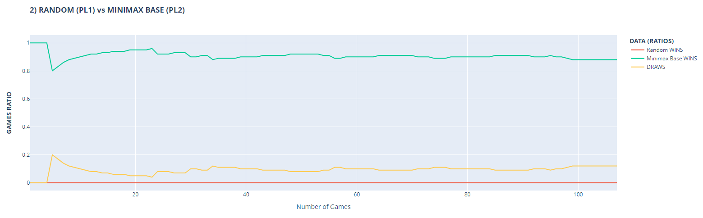
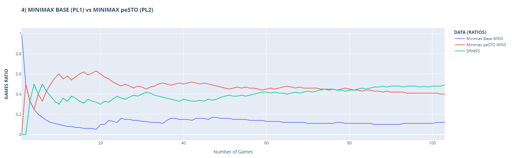

# CHESS ♟️

## WHAT
♟️Developed **chess** game from scratch implementing an **autonomous player** using specific algorithms, such as MiniMax with Alpha‑beta pruning  
💻 Three autonomous players ➡️ Random / MiniMax Base / MiniMax Advanced 
📊 A [**python script**](./GameData/chessdata.py) has also been integrated to show bot performance data against each other.

## LEARNING
☁️ Decision algorithms  
🏎️ Fast prototyping

## STACK
🧑‍💻 C++ / Unreal Engine 5.2 / Python 

## HOW TO PLAY ♟️
#### MOVE PIECES
- When it is your turn, click on the piece you want to move. After that, possible moves of that piece are graphically shown
- To confirm a move click on the tile you want to move on or the opponent's piece you want to capture
#### REPLAY
- History of the moves done in the game is shown on the right part of the screen (in proper buttons)
- To view previous moves, you can just click on the button of the move you want to view. 
The board configuration will be loaded as it was at that move.
- <b>REWIND</b>: ONLY if you click on an opponent turn, you can active the rewind function by clicking one of your pieces.
Then you can resume the game from this position

### SAMPLE GAME

### UML

### (BOT) PERFORMANCE ([data](./GameData))

#### 1) RANDOM (red) vs MINIMAX BASE (green)

#### 2) MINIMAX BASE (red) vs MINIMAX ADVANCED (green)

