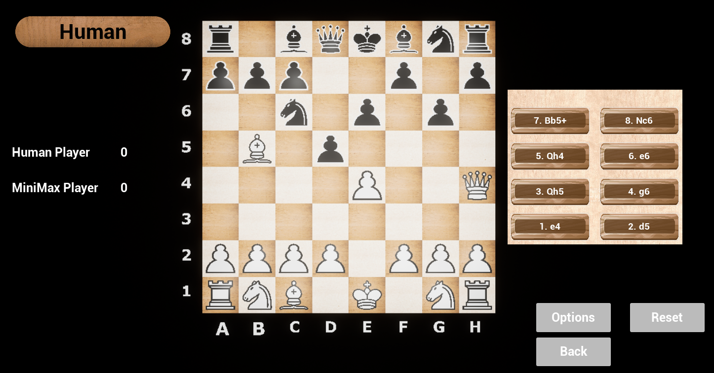

# CHESS

## WHAT
- Individual project for Design and Analysis of Algorithms course at the University of Genoa
- Developing a chess game implementing two different CPU intelligences: Random and Smart. 
The smart one is the result of specific algorithms such as MiniMax and Alpha-beta pruning

A simple [python script](./GameData/chessdata.py) (using pandas and plotly) has also been implemented 
to show bot performance data against each other.

## LEARNING
- Decision algorithms
- Fast prototyping

## STACK
- C++
- Unreal Engine 5.2
- Python (Statistics data management)

### SAMPLE GAME

### UML

### (BOT) PERFORMANCES
#### 1) Random vs Random

#### 2) Random vs MiniMax

#### 3) MiniMax vs MiniMax
