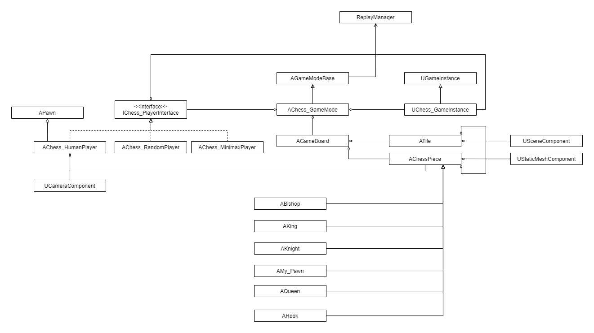
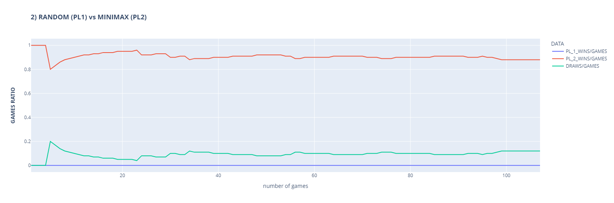
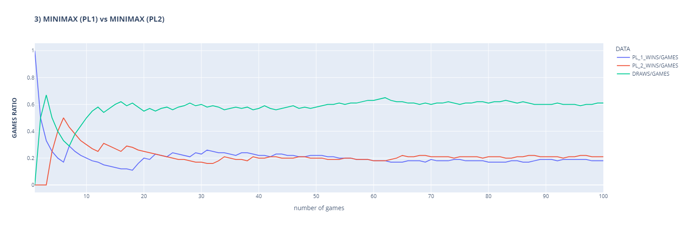

# CHESS

## WHAT
- Individual project for Design and Analysis of Algorithms course at the University of Genoa
- Developing a chess game implementing two different CPU intelligences: Random and Smart. 
The smart one is the result of specific algorithms such as MiniMax and Alpha-beta pruning
- A simple [python script](./GameData/chessdata.py) (using pandas and plotly) has also been implemented 
to show bot performance data against each other.

## LEARNING
- Decision algorithms
- Fast prototyping

## STACK
- C++
- Unreal Engine 5.2
- Python (Statistics data management)

## HOW TO PLAY
#### MOVE PIECES
- When it is your turn, click on the piece you want to move. After that, possible moves of that piece are graphically shown
- To confirm a move click on the tile you want to move on or the opponent's piece you want to capture
#### REPLAY
- History of the moves done in the game is shown on the right part of the screen (in proper buttons)
- To view previous moves, you can just click on the button of the move you want to view. 
The board configuration will be loaded as it was at that move.
- <b>REWIND</b>: ONLY if you click on an opponent turn, you can active the rewind function by clicking one of your pieces.
Then you can resume the game from this position

### SAMPLE GAME

### UML

### (BOT) PERFORMANCES ([data](./GameData))
#### 1) RANDOM vs RANDOM

#### 2) RANDOM vs MINIMAX

#### 3) MINIMAX vs MINIMAX
